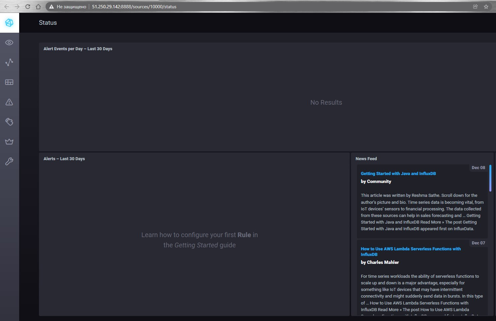
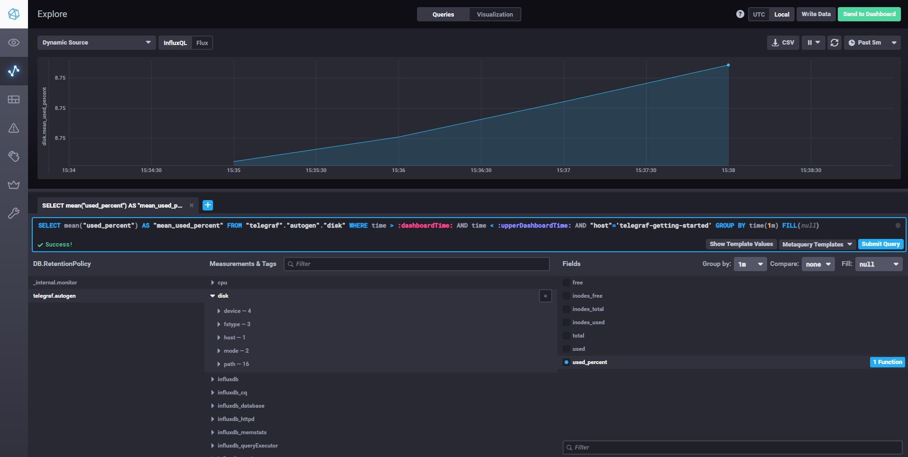
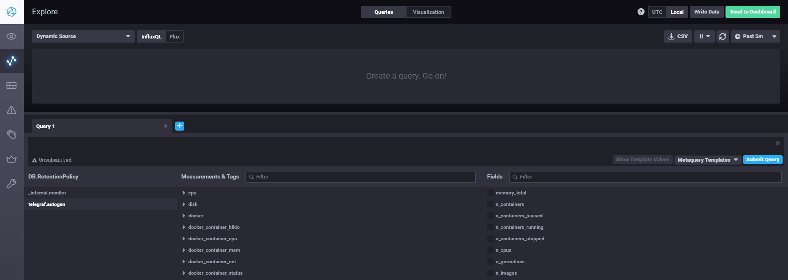
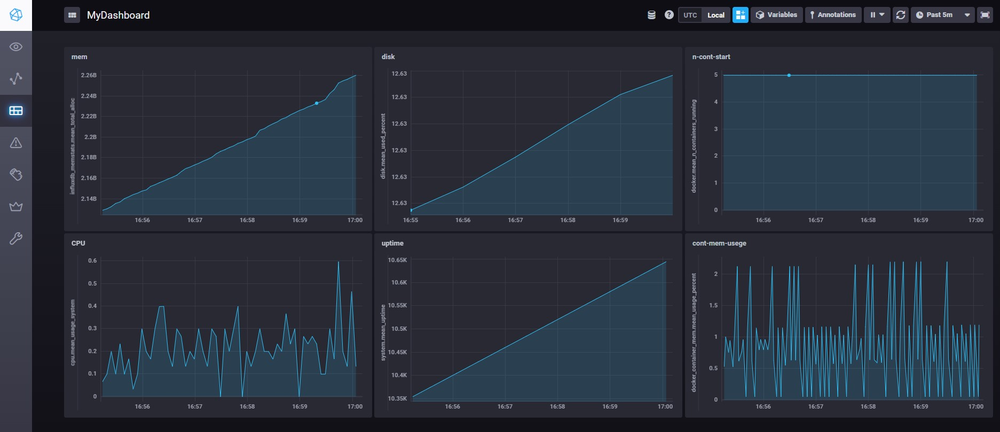

### Домашнее задание к занятию "10.02. Системы мониторинга"

#### Обязательные задания

>1. Опишите основные плюсы и минусы pull и push систем мониторинга.

Pull:
```
+ Легче контролировать подлинность данных
+ Легче производить отладку
+ Удобнее администрировать большое число источников данных
+ Можно использовать proxy-server с TLS
- Нужно открывать доступ с сервера к каждому источнику данных
```

Push:
```
+ Упрощение репликации данных в разные системы мониторинга или их резервные копии
+ Более гибкая настройка отправки пакетов данных
+ Можно выполнять по протоколу UDP, что может повысит скорость работы
+ Источних данных можно закрыть файрволом для доступа извне
- Сложнее контролировать подлинность данных
- Сложнее производить отладку
- При использовании UDP возможна потеря данных
```
>2. Какие из ниже перечисленных систем относятся к push модели, а какие к pull? А может есть гибридные?

    - Prometheus - pull
    - TICK - push
    - Zabbix - push/push
    - VictoriaMetrics - push/push
    - Nagios - push

>3. Склонируйте себе [репозиторий](https://github.com/influxdata/sandbox/tree/master) и запустите TICK-стэк, 
используя технологии docker и docker-compose.
>
>В виде решения на это упражнение приведите выводы команд с вашего компьютера >(виртуальной машины):
>
>    - curl http://localhost:8086/ping
>    - curl http://localhost:8888
>    - curl http://localhost:9092/kapacitor/v1/ping

```
root@docker-ubuntu:~/git/sandbox# curl http://localhost:8086/ping
root@docker-ubuntu:~/git/sandbox# curl http://localhost:8888
<!DOCTYPE html><html><head><meta http-equiv="Content-type" content="text/html; charset=utf-8"><title>Chronograf</title><link rel="icon shortcut" href="/favicon.fa749080.ico"><link rel="stylesheet" href="/src.3dbae016.css"></head><body> <div id="react-root" data-basepath=""></div> <script src="/src.fab22342.js"></script> </body></html>
root@docker-ubuntu:~/git/sandbox# curl http://localhost:9092/kapacitor/v1/ping
root@docker-ubuntu:~/git/sandbox#
```

>А также скриншот веб-интерфейса ПО chronograf (`http://localhost:8888`). 



>P.S.: если при запуске некоторые контейнеры будут падать с ошибкой - проставьте им режим `Z`, например
`./data:/var/lib:Z`
>
>4. Перейдите в веб-интерфейс Chronograf (`http://localhost:8888`) и откройте >вкладку `Data explorer`.
>
>    - Нажмите на кнопку `Add a query`
>    - Изучите вывод интерфейса и выберите БД `telegraf.autogen`
>    - В `measurments` выберите mem->host->telegraf_container_id , а в `fields` >      выберите used_percent. 
>       Внизу появится график утилизации оперативной памяти в контейнере telegraf.
>    - Вверху вы можете увидеть запрос, аналогичный SQL-синтаксису. 
    Поэкспериментируйте с запросом, попробуйте изменить группировку и интервал наблюдений.
>
>Для выполнения задания приведите скриншот с отображением метрик утилизации >места на диске 
>(disk->host->telegraf_container_id) из веб-интерфейса.



>5. Изучите список [telegraf inputs](https://github.com/influxdata/telegraf/tree/master/plugins/inputs). 
Добавьте в конфигурацию telegraf следующий плагин - [docker](https://github.com/influxdata/telegraf/tree/master/plugins/inputs/docker):
>```
>[[inputs.docker]]
>  endpoint = "unix:///var/run/docker.sock"
>```
>
>Дополнительно вам может потребоваться донастройка контейнера telegraf в >`docker-compose.yml` дополнительного volume и 
>режима privileged:
>```
>  telegraf:
>    image: telegraf:1.4.0
>    privileged: true
>    volumes:
>      - ./etc/telegraf.conf:/etc/telegraf/telegraf.conf:Z
>      - /var/run/docker.sock:/var/run/docker.sock:Z
>    links:
>      - influxdb
>    ports:
>      - "8092:8092/udp"
>      - "8094:8094"
>      - "8125:8125/udp"
>```
>
>После настройке перезапустите telegraf, обновите веб интерфейс и приведите >скриншотом список `measurments` в 
>веб-интерфейсе базы telegraf.autogen . Там должны появиться метрики, связанные >с docker.



>Факультативно можете изучить какие метрики собирает telegraf после выполнения данного задания.

>#### Дополнительное задание (со звездочкой*) - необязательно к выполнению
>
>В веб-интерфейсе откройте вкладку `Dashboards`. Попробуйте создать свой >dashboard с отображением:
>
>    - утилизации ЦПУ
>    - количества использованного RAM
>    - утилизации пространства на дисках
>    - количество поднятых контейнеров
>    - аптайм
>    - ...
>    - фантазируйте)
>    
>    ---



