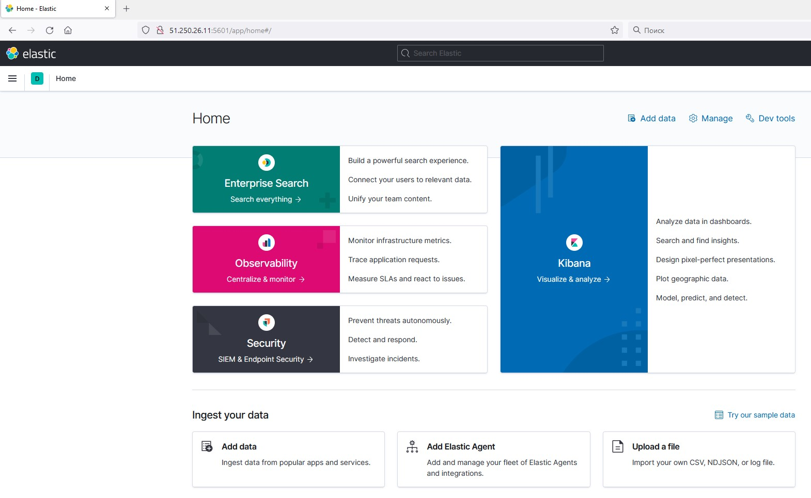

### Домашнее задание к занятию "10.04. ELK"

#### Дополнительные ссылки

При выполнении задания пользуйтесь вспомогательными ресурсами:

- [поднимаем elk в докер](https://www.elastic.co/guide/en/elastic-stack-get-started/current/get-started-docker.html)
- [поднимаем elk в докер с filebeat и докер логами](https://www.sarulabs.com/post/5/2019-08-12/sending-docker-logs-to-elasticsearch-and-kibana-with-filebeat.html)
- [конфигурируем logstash](https://www.elastic.co/guide/en/logstash/current/configuration.html)
- [плагины filter для logstash](https://www.elastic.co/guide/en/logstash/current/filter-plugins.html)
- [конфигурируем filebeat](https://www.elastic.co/guide/en/beats/libbeat/5.3/config-file-format.html)
- [привязываем индексы из elastic в kibana](https://www.elastic.co/guide/en/kibana/current/index-patterns.html)
- [как просматривать логи в kibana](https://www.elastic.co/guide/en/kibana/current/discover.html)
- [решение ошибки increase vm.max_map_count elasticsearch](https://stackoverflow.com/questions/42889241/how-to-increase-vm-max-map-count)

В процессе выполнения задания могут возникнуть также не указанные тут проблемы в зависимости от системы.

Используйте output stdout filebeat/kibana и api elasticsearch для изучения корня проблемы и ее устранения.

#### Задание повышенной сложности

Не используйте директорию [help](./help) при выполнении домашнего задания.

#### Задание 1

Вам необходимо поднять в докере:
- elasticsearch(hot и warm ноды)
- logstash
- kibana
- filebeat

и связать их между собой.

Logstash следует сконфигурировать для приёма по tcp json сообщений.

Filebeat следует сконфигурировать для отправки логов docker вашей системы в logstash.

В директории [help](./help) находится манифест docker-compose и конфигурации filebeat/logstash для быстрого 
выполнения данного задания.

Результатом выполнения данного задания должны быть:
- скриншот `docker ps` через 5 минут после старта всех контейнеров (их должно быть 5)


- скриншот интерфейса kibana



- docker-compose манифест (если вы не использовали директорию help)

немного подправил манифест в разделе logstash:

```
logstash:
    image: docker.elastic.co/logstash/logstash:6.3.2
    container_name: logstash
    ports:
#      - 5046:5046
      - 5044:5044
    volumes:
#      - ./configs/logstash.conf:/etc/logstash/conf.d/logstash.conf:Z
#      - ./configs/logstash.yml:/opt/logstash/config/logstash.yml:Z
      - ./configs/logstash.conf:/usr/share/logstash/pipeline/logstash.conf:Z
      - ./configs/logstash.yml:/usr/share/logstash/config/logstash.yml:Z 
    networks:
      - elastic
    depends_on:
      - es-hot
      - es-warm
```

- ваши yml конфигурации для стека (если вы не использовали директорию help)

filebeat.yml:
```
filebeat.inputs:
  - type: container
    paths:
      - '/var/lib/docker/containers/3f0557c78316653eef327cf14b9502097d0050a10f8297c6766449b5995786e7/*.log' # контейнер с dummy приложением

processors:
  - add_docker_metadata:
      host: "unix:///var/run/docker.sock"

  - decode_json_fields:
      fields: ["message"]
      target: "json"
      overwrite_keys: true

output.logstash:
  hosts: ["logstash:5044"]
```
logstash.conf:
```
input {
  beats {
    port => 5044
  }
}

filter {
  json {
    source => "message"
  }
  date{
    match => ["time", "ISO8601"]
    target => "@timestamp"
  }
  ruby {
    code => "event.set('indexDay', event.get('[@timestamp]').time.localtime('+03:00').strftime('%Y%m%d'))"
  }
}

output {
  elasticsearch {
    hosts => ["es-hot:9200"]
    index => "logstash_app-%{indexDay}"
    codec => json
  }
  stdout { codec => rubydebug }
}
```

## Задание 2

Перейдите в меню [создания index-patterns  в kibana](http://localhost:5601/app/management/kibana/indexPatterns/create)
и создайте несколько index-patterns из имеющихся.

Перейдите в меню просмотра логов в kibana (Discover) и самостоятельно изучите как отображаются логи и как производить 
поиск по логам.

В манифесте директории help также приведенно dummy приложение, которое генерирует рандомные события в stdout контейнера.
Данные логи должны порождать индекс logstash-* в elasticsearch. Если данного индекса нет - воспользуйтесь советами 
и источниками из раздела "Дополнительные ссылки" данного ДЗ.
 


 
