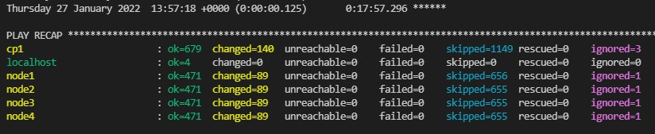
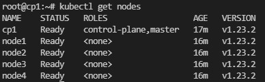

>### Домашнее задание к занятию "12.4 Развертывание кластера на собственных >серверах, лекция 2"
>Новые проекты пошли стабильным потоком. Каждый проект требует себе >несколько кластеров: под тесты и продуктив. Делать все руками — не >вариант, поэтому стоит автоматизировать подготовку новых кластеров.
>
>#### Задание 1: Подготовить инвентарь kubespray
>Новые тестовые кластеры требуют типичных простых настроек. Нужно >подготовить инвентарь и проверить его работу. Требования к инвентарю:
>* подготовка работы кластера из 5 нод: 1 мастер и 4 рабочие ноды;
>* в качестве CRI — containerd;
>* запуск etcd производить на мастере.
>
>#### Задание 2 (*): подготовить и проверить инвентарь для кластера в AWS
>Часть новых проектов хотят запускать на мощностях AWS. Требования похожи:
>* разворачивать 5 нод: 1 мастер и 4 рабочие ноды;
>* работать должны на минимально допустимых EC2 — t3.small.


---
Для выполнения задания создал 5 ВМ на Yandex Cloud:
```
#!/bin/bash

set -e

function create_vm {
  local NAME=$1

  YC=$(cat <<END
    yc compute instance create \
      --name $NAME \
      --zone ru-central1-c \
      --network-interface subnet-name=default-ru-central1-c,nat-ip-version=ipv4 \
      --memory 2 \
      --cores 2 \
      --preemptible \
      --create-boot-disk image-folder-id=standard-images,image-family=ubuntu-2004-lts,type=network-ssd,size=20 \
      --ssh-key /home/aks/.ssh/id_rsa.pub
END
)
  eval "$YC"
}

create_vm "cp1"
create_vm "node1"
create_vm "node2"
create_vm "node3"
create_vm "node4"
```
Файл hosts.yaml получился следующего вида:
```
all:
  hosts:
    cp1:
      ansible_host: 178.154.249.179
      ip: 10.130.0.18   
    node1:
      ansible_host: 178.154.250.159
      ip: 10.130.0.27      
    node2:
      ansible_host: 178.154.250.206
      ip: 10.130.0.26    
    node3:
      ansible_host: 178.154.248.161
      ip: 10.130.0.21   
    node4:
      ansible_host: 178.154.250.214
      ip: 10.130.0.11
  children:
    kube_control_plane:
      hosts:
        cp1:
    kube_node:
      hosts:
        node1:
        node2:
        node3:
        node4:
    etcd:
      hosts:
        cp1:
    k8s_cluster:
      children:
        kube_control_plane:
        kube_node:
    calico_rr:
      hosts: {}
```
Также потребовалось указать дополнительную переменную в all.yml - `ansible_user: yc-user`

В файле k8s-cluster.yml в качестве CRI уже был указан containerd - `container_manager: containerd` 

Далее выполнил команду 

`ansible-playbook -i inventory/mycluster/hosts.yaml cluster.yml -b -v`





---