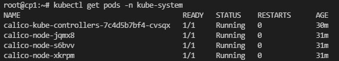
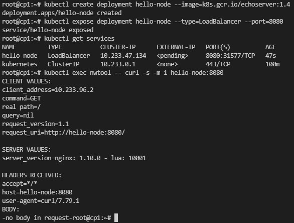
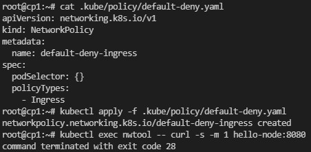
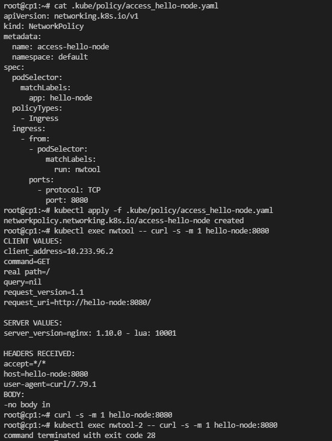
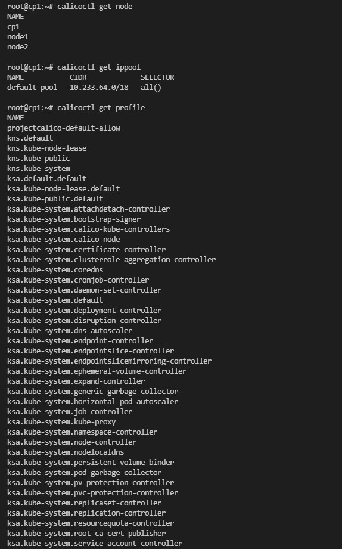

>### Домашнее задание к занятию "12.5 Сетевые решения CNI"
>После работы с Flannel появилась необходимость обеспечить безопасность для >приложения. Для этого лучше всего подойдет Calico.
>#### Задание 1: установить в кластер CNI плагин Calico
>Для проверки других сетевых решений стоит поставить отличный от Flannel >плагин — например, Calico. Требования: 
>* установка производится через ansible/kubespray;
>* после применения следует настроить политику доступа к hello-world извне. >Инструкции [kubernetes.io](https://kubernetes.io/docs/concepts/>services-networking/network-policies/), [Calico](https://docs.>projectcalico.org/about/about-network-policy)

Плагин Calico при установке через kuberspray устанавливается по-умолчанию.

Создаем сервис и проверяем доступность без сетевых политик:

Создаем политику запрещающую все входящие соединения и проверяем доступность сервиса снова:

Создаем политику разрешающую доступ с пода nwtool и проверяем сервис:

Как видно, сервис доступен только с пода nwtool, как и указано в политике.

>#### Задание 2: изучить, что запущено по умолчанию
>Самый простой способ — проверить командой calicoctl get <type>. Для >проверки стоит получить список нод, ipPool и profile.
>Требования: 
>* установить утилиту calicoctl;
>* получить 3 вышеописанных типа в консоли.

