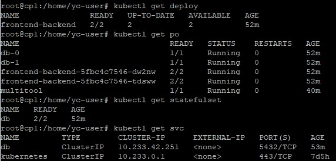
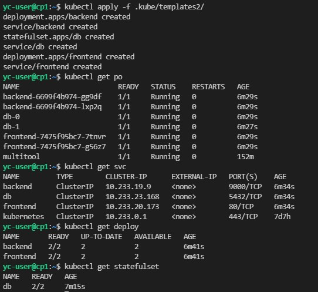

>### Домашнее задание к занятию "13.1 контейнеры, поды, deployment, >statefulset, services, endpoints"
>Настроив кластер, подготовьте приложение к запуску в нём. Приложение >стандартное: бекенд, фронтенд, база данных. Его можно найти в папке >13-kubernetes-config.
>
>#### Задание 1: подготовить тестовый конфиг для запуска приложения
>Для начала следует подготовить запуск приложения в stage окружении с >простыми настройками. Требования:
>* под содержит в себе 2 контейнера — фронтенд, бекенд;
>* регулируется с помощью deployment фронтенд и бекенд;
>* база данных — через statefulset.

Для выполнения задания собрал образы контейнеров frontend и backend из папки 13-kubernetes-config и залил их в свой репозиторий DockerHub. Далее создал yaml-файлы для развертывания приложения в папке tamplates:

front-back-deploy.yaml

```
---
apiVersion: apps/v1
kind: Deployment
metadata:
  name: frontend-backend
  labels:
    app: fb
spec:
  replicas: 2
  selector:
    matchLabels:
      app: fb
  template:
    metadata:
      labels:
        app: fb
    spec:
      containers:
      - name: frontend
        image: aksdoc/kub-frontend:latest
        ports:
        - containerPort: 8000
      - name: backend
        image: aksdoc/kub-backend:latest
        ports:
        - containerPort: 9000
```
pgsql-stateful.yaml
```
---
apiVersion: apps/v1
kind: StatefulSet
metadata:
  name: db
spec:
  selector:
    matchLabels:
      app: db
  serviceName: "db"
  replicas: 2
  template:
    metadata:
      labels:
        app: db
    spec:
      terminationGracePeriodSeconds: 10
      containers:
      - name: db
        image: postgres:13-alpine
        ports:
        - containerPort: 5432
        env:
          - name: POSTGRES_PASSWORD
            value: postgres
          - name: POSTGRES_USER
            value: postgres
          - name: POSTGRES_DB
            value: news
```    
service-db.yaml
```
---
apiVersion: v1
kind: Service
metadata:
  name: db
spec:
  selector:
    app: db
  ports:
    - protocol: TCP
      port: 5432
      targetPort: 5432
```        
Далее применяем конфигурацию командой ```kubectl apply -f tamplates/``` 



>#### Задание 2: подготовить конфиг для production окружения
>Следующим шагом будет запуск приложения в production окружении. >Требования сложнее:
>* каждый компонент (база, бекенд, фронтенд) запускаются в своем поде, >регулируются отдельными deployment’ами;
>* для связи используются service (у каждого компонента свой);
>* в окружении фронта прописан адрес сервиса бекенда;
>* в окружении бекенда прописан адрес сервиса базы данных.

Frontend:
```
---
apiVersion: apps/v1
kind: Deployment
metadata:
  name: frontend
  labels:
    app: frontend
spec:
  replicas: 2
  selector:
    matchLabels:
      app: frontend
  template:
    metadata:
      labels:
        app: frontend
    spec:
      containers:
      - name: frontend
        image: aksdoc/kub-frontend:latest
        ports:
        - containerPort: 8000
        env:
          - name: BASE_URL
            value: http://backend:9000

---
apiVersion: v1
kind: Service
metadata:
  name: frontend
spec:
  selector:
    app: frontend
  ports:
    - protocol: TCP
      port: 80
      targetPort: 8000
```
Backend:
```
---
apiVersion: apps/v1
kind: Deployment
metadata:
  name: backend
  labels:
    app: backend
spec:
  replicas: 2
  selector:
    matchLabels:
      app: backend
  template:
    metadata:
      labels:
        app: backend
    spec:
      containers:
      - name: backend
        image: aksdoc/kub-backend:latest
        ports:
        - containerPort: 9000
        env:
          - name: DATABASE_URL
            value: postgres://postgres:postgres@db:5432/news
        

---
apiVersion: v1
kind: Service
metadata:
  name: backend
spec:
  selector:
    app: backend
  ports:
    - protocol: TCP
      port: 9000
      targetPort: 9000
```
Database:
```
---
apiVersion: apps/v1
kind: StatefulSet
metadata:
  name: db
spec:
  selector:
    matchLabels:
      app: db
  serviceName: "db"
  replicas: 2
  template:
    metadata:
      labels:
        app: db
    spec:
      terminationGracePeriodSeconds: 10
      containers:
      - name: db
        image: postgres:13-alpine
        ports:
        - containerPort: 5432
        env:
          - name: POSTGRES_PASSWORD
            value: postgres
          - name: POSTGRES_USER
            value: postgres
          - name: POSTGRES_DB
            value: news

---
apiVersion: v1
kind: Service
metadata:
  name: db
spec:
  selector:
    app: db
  ports:
    - protocol: TCP
      port: 5432
      targetPort: 5432            
```



#### Задание 3 (*): добавить endpoint на внешний ресурс api
Приложению потребовалось внешнее api, и для его использования лучше добавить endpoint в кластер, направленный на это api. Требования:
* добавлен endpoint до внешнего api (например, геокодер).

