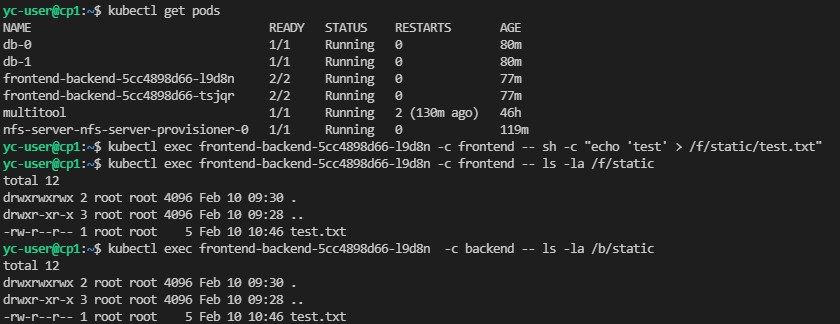
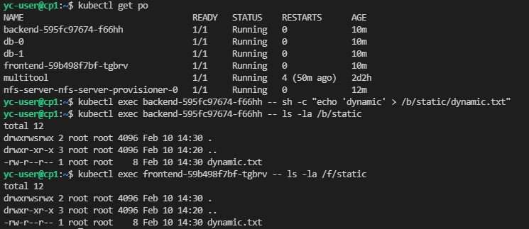

>### Домашнее задание к занятию "13.2 разделы и монтирование"
>Приложение запущено и работает, но время от времени появляется >необходимость передавать между бекендами данные. А сам бекенд генерирует >статику для фронта. Нужно оптимизировать это.
>Для настройки NFS сервера можно воспользоваться следующей инструкцией >(производить под пользователем на сервере, у которого есть доступ до >kubectl):
>* установить helm: curl https://raw.githubusercontent.com/helm/helm/>master/scripts/get-helm-3 | bash
>* добавить репозиторий чартов: helm repo add stable https://charts.helm.>sh/stable && helm repo update
>* установить nfs-server через helm: helm install nfs-server stable/>nfs-server-provisioner
>
>В конце установки будет выдан пример создания PVC для этого сервера.
>
>#### Задание 1: подключить для тестового конфига общую папку
>В stage окружении часто возникает необходимость отдавать статику бекенда >сразу фронтом. Проще всего сделать это через общую папку. Требования:
>* в поде подключена общая папка между контейнерами (например, /static);
>* после записи чего-либо в контейнере с беком файлы можно получить из >контейнера с фронтом.

```
---
apiVersion: apps/v1
kind: Deployment
metadata:
  name: frontend-backend
  labels:
    app: fb
spec:
  replicas: 2
  selector:
    matchLabels:
      app: fb
  template:
    metadata:
      labels:
        app: fb
    spec:
      containers:
      - name: frontend
        image: aksdoc/kub-frontend:latest
        ports:
        - containerPort: 8000
        volumeMounts:
        - mountPath: "/f/static"
          name: share
      - name: backend
        image: aksdoc/kub-backend:latest
        ports:
        - containerPort: 9000
        volumeMounts:
        - mountPath: "/b/static"
          name: share
      volumes:
      - name: share
        emptyDir: {}
```


>#### Задание 2: подключить общую папку для прода
>Поработав на stage, доработки нужно отправить на прод. В продуктиве у >нас контейнеры крутятся в разных подах, поэтому потребуется PV и связь >через PVC. Сам PV должен быть связан с NFS сервером. Требования:
>* все бекенды подключаются к одному PV в режиме ReadWriteMany;
>* фронтенды тоже подключаются к этому же PV с таким же режимом;
>* файлы, созданные бекендом, должны быть доступны фронту.

frontend:
```
---
apiVersion: apps/v1
kind: Deployment
metadata:
  name: frontend
  labels:
    app: frontend
spec:
  replicas: 1
  selector:
    matchLabels:
      app: frontend
  template:
    metadata:
      labels:
        app: frontend
    spec:
      containers:
      - name: frontend
        image: aksdoc/kub-frontend:latest
        ports:
        - containerPort: 8000
        env:
          - name: BASE_URL
            value: http://backend:9000
        volumeMounts:
        - mountPath: "/f/static"
          name: pv  
      volumes:
      - name: pv
        persistentVolumeClaim:
          claimName: pvc          
```

backend:
```
---
apiVersion: apps/v1
kind: Deployment
metadata:
  name: backend
  labels:
    app: backend
spec:
  replicas: 1
  selector:
    matchLabels:
      app: backend
  template:
    metadata:
      labels:
        app: backend
    spec:
      containers:
      - name: backend
        image: aksdoc/kub-backend:latest
        ports:
        - containerPort: 9000
        env:
          - name: DATABASE_URL
            value: postgres://postgres:postgres@db:5432/news
        volumeMounts:
        - mountPath: "/b/static"
          name: pv
      volumes:
      - name: pv
        persistentVolumeClaim:
          claimName: pvc
```

pv-pvc:
```
---
apiVersion: v1
kind: PersistentVolume
metadata:
  name: pv
spec:
  accessModes:
    - ReadWriteMany
  capacity:
    storage: 2Gi
  hostPath:
    path: /data/pv
  persistentVolumeReclaimPolicy: Retain

---  
apiVersion: v1
kind: PersistentVolumeClaim
metadata:
  name: pvc
spec:
  storageClassName: "nfs"
  accessModes:
    - ReadWriteMany
  resources:
    requests:
      storage: 2Gi
```

