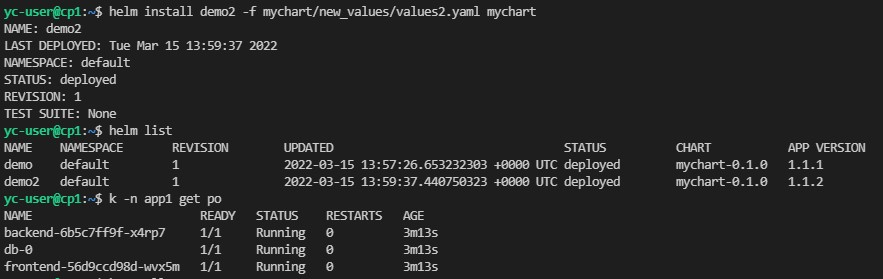

>### Домашнее задание к занятию "13.4 инструменты для упрощения написания >конфигурационных файлов. Helm и Jsonnet"
>В работе часто приходится применять системы автоматической генерации >конфигураций. Для изучения нюансов использования разных инструментов нужно >попробовать упаковать приложение каждым из них.
>
>#### Задание 1: подготовить helm чарт для приложения
>Необходимо упаковать приложение в чарт для деплоя в разные окружения. >Требования:
>* каждый компонент приложения деплоится отдельным deployment’ом/statefulset’ом;

Приложение использую из предыдущих заданий. Чарт состоит из двух deployment, одного statefulset и одного сервиса - [mychart](https://github.com/alex-k-7/devops-netology/tree/main/homeworks/13-kubernetes-config/13.4-kubernetes-config-helm/mychart)


>* в переменных чарта измените образ приложения для изменения версии.

Меняем переменную tag в [values.yaml](https://github.com/alex-k-7/devops-netology/blob/main/homeworks/13-kubernetes-config/13.4-kubernetes-config-helm/mychart/values.yaml)


>#### Задание 2: запустить 2 версии в разных неймспейсах
>Подготовив чарт, необходимо его проверить. Попробуйте запустить несколько копий >приложения:
>* одну версию в namespace=app1;


>* вторую версию в том же неймспейсе;

При попытке установить новый релиз в том же неймспейсе поменяв tag выдает ошибку:
```
yc-user@cp1:~$ helm install demo2 -f mychart/new_values/values2.yaml mychart
Error: INSTALLATION FAILED: rendered manifests contain a resource that already exists. Unable to continue with install: Namespace "helm" in namespace "" exists and cannot be imported into the current release: invalid ownership metadata; annotation validation error: key "meta.helm.sh/release-name" must equal "demo2": current value is "demo"
```
Однако, если поменять также и переменную appVersion в chart.yaml, то релиз установится. Но такое ощущение, что в этом нет смысла. Новых подов не появилось... Должен быть всё-таки другой неймспейс.



>* третью версию в namespace=app2.

Вот здесь всё сходится. Отдельный релиз, отдельные поды в другом неймспейсе и новая версия образа.


