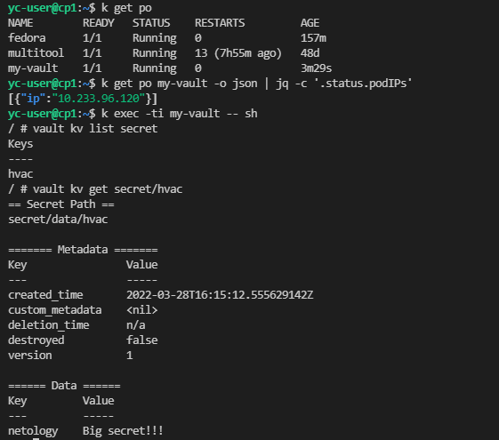

>### Домашнее задание к занятию "14.2 Синхронизация секретов с >внешними сервисами. Vault"
>
>#### Задача 1: Работа с модулем Vault
>
>Запустить модуль Vault конфигураций через утилиту kubectl в >установленном minikube
>
>```
>kubectl apply -f 14.2/vault-pod.yml
>```
>
>Получить значение внутреннего IP пода
>
>```
>kubectl get pod 14.2-netology-vault -o json | jq -c '.status.podIPs'
>```
>
>Примечание: jq - утилита для работы с JSON в командной строке
>
>Запустить второй модуль для использования в качестве клиента
>
>```
>kubectl run -i --tty fedora --image=fedora --restart=Never -- sh
>```
>
>Установить дополнительные пакеты
>
>```
>dnf -y install pip
>pip install hvac
>```
>
>Запустить интепретатор Python и выполнить следующий код, >предварительно
>поменяв IP и токен
>
>```
>import hvac
>client = hvac.Client(
>    url='http://10.10.133.71:8200',
>    token='aiphohTaa0eeHei'
>)
>client.is_authenticated()
>
># Пишем секрет
>client.secrets.kv.v2.create_or_update_secret(
>    path='hvac',
>    secret=dict(netology='Big secret!!!'),
>)
>
># Читаем секрет
>client.secrets.kv.v2.read_secret_version(
>    path='hvac',
>)
>```

Поднимаем под, указывая все необходимые переменные - [vault-pod.yaml](https://github.com/alex-k-7/devops-netology/blob/main/homeworks/14-kubernetes-security/14.2-kubernetes-vault/vault-pod.yaml)

Запускаем второй под в качестве клиента:
```
k run -it fedora --image=fedora --restart=Never -- sh
```
Далее смотрим IP пода my-vault, указываем его в скрипте [secret-add.py](https://github.com/alex-k-7/devops-netology/blob/main/homeworks/14-kubernetes-security/14.2-kubernetes-vault/secret-add.py) и запускаем скрипт. Проверяем, что получилось:



Срипт отработал - появился новые секрет.