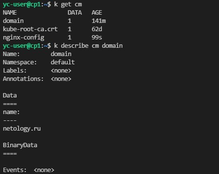
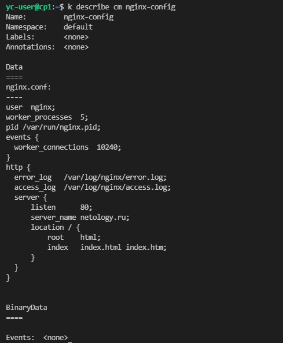
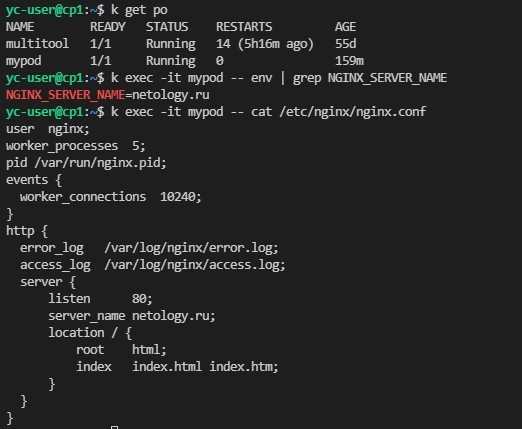

>### Домашнее задание к занятию "14.3 Карты конфигураций"
>
>#### Задача 1: Работа с картами конфигураций через утилиту >kubectl в установленном minikube
>
>Выполните приведённые команды в консоли. Получите вывод команд. >Сохраните
>задачу 1 как справочный материал.
>
>##### Как создать карту конфигураций?
>
>```
>kubectl create configmap nginx-config --from-file=nginx.conf
>kubectl create configmap domain --from-literal=name=netology.ru
>```
>
>##### Как просмотреть список карт конфигураций?
>
>```
>kubectl get configmaps
>kubectl get configmap
>```
>
>##### Как просмотреть карту конфигурации?
>
>```
>kubectl get configmap nginx-config
>kubectl describe configmap domain
>```
>
>##### Как получить информацию в формате YAML и/или JSON?
>
>```
>kubectl get configmap nginx-config -o yaml
>kubectl get configmap domain -o json
>```
>
>##### Как выгрузить карту конфигурации и сохранить его в файл?
>
>```
>kubectl get configmaps -o json > configmaps.json
>kubectl get configmap nginx-config -o yaml > nginx-config.yml
>```
>
>##### Как удалить карту конфигурации?
>
>```
>kubectl delete configmap nginx-config
>```
>
>##### Как загрузить карту конфигурации из файла?
>
>```
>kubectl apply -f nginx-config.yml
>```
>
>#### Задача 2 (*): Работа с картами конфигураций внутри модуля
>
>Выбрать любимый образ контейнера, подключить карты конфигураций >и проверить
>их доступность как в виде переменных окружения, так и в виде >примонтированного
>тома

Создал две карты конфигураций - domain и nginx-config:





В виде переменной окружения привязал карту domain, в виде тома - nginx-config:
```
apiVersion: v1
kind: Pod
metadata:
  name: mypod
spec:
  containers:
  - name: mypod
    image: nginx
    env:
      - name: NGINX_SERVER_NAME
        valueFrom:
          configMapKeyRef:
            name: domain
            key: name       
    volumeMounts:
      - name: config
        mountPath: /etc/nginx
        readOnly: true
  volumes:
  - name: config
    configMap: 
      name: nginx-config
```


