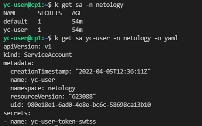
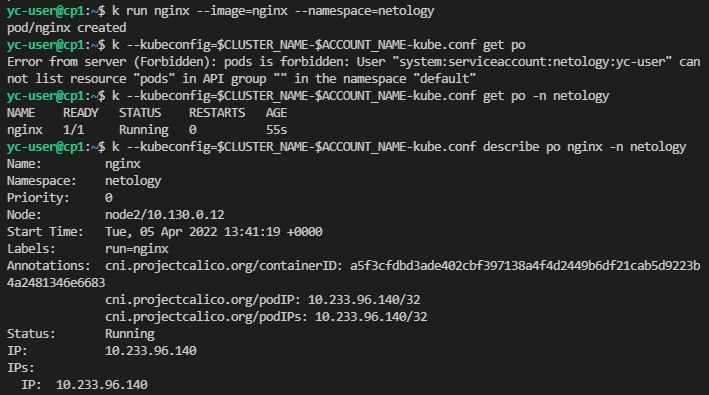
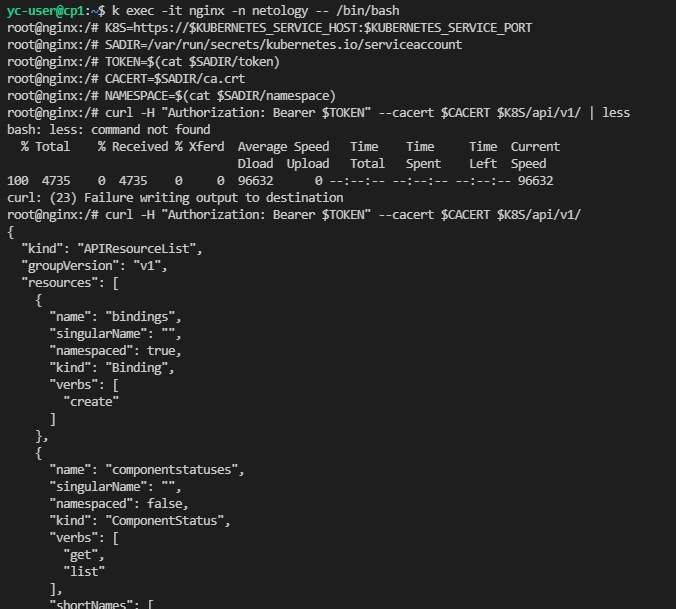

>### Домашнее задание к занятию "14.4 Сервис-аккаунты"
>
>#### Задача 1: Работа с сервис-аккаунтами через утилиту kubectl в >установленном minikube
>
>Выполните приведённые команды в консоли. Получите вывод команд. Сохраните
>задачу 1 как справочный материал.
>
>##### Как создать сервис-аккаунт?
>
>```
>kubectl create serviceaccount netology
>```
>
>##### Как просмотреть список сервис-акаунтов?
>
>```
>kubectl get serviceaccounts
>kubectl get serviceaccount
>```
>
>##### Как получить информацию в формате YAML и/или JSON?
>
>```
>kubectl get serviceaccount netology -o yaml
>kubectl get serviceaccount default -o json
>```
>
>#### Как выгрузить сервис-акаунты и сохранить его в файл?
>
>```
>kubectl get serviceaccounts -o json > serviceaccounts.json
>kubectl get serviceaccount netology -o yaml > netology.yml
>```
>
>##### Как удалить сервис-акаунт?
>
>```
>kubectl delete serviceaccount netology
>```
>
>##### Как загрузить сервис-акаунт из файла?
>
>```
>kubectl apply -f netology.yml
>```
>
>#### Задача 2 (*): Работа с сервис-акаунтами внутри модуля
>
>Выбрать любимый образ контейнера, подключить сервис-акаунты и проверить
>доступность API Kubernetes
>
>```
>kubectl run -i --tty fedora --image=fedora --restart=Never -- sh
>```
>
>Просмотреть переменные среды
>
>```
>env | grep KUBE
>```
>
>Получить значения переменных
>
>```
>K8S=https://$KUBERNETES_SERVICE_HOST:$KUBERNETES_SERVICE_PORT
>SADIR=/var/run/secrets/kubernetes.io/serviceaccount
>TOKEN=$(cat $SADIR/token)
>CACERT=$SADIR/ca.crt
>NAMESPACE=$(cat $SADIR/namespace)
>```
>
>Подключаемся к API
>
>```
>curl -H "Authorization: Bearer $TOKEN" --cacert $CACERT $K8S/api/v1/
>```
>
>В случае с minikube может быть другой адрес и порт, который можно взять здесь
>
>```
>cat ~/.kube/config
>```
>
>или здесь
>
>```
>kubectl cluster-info
>```

По [инструкции](https://github.com/hamnsk/k8s/blob/main/serviceaccount.md) создал сервис аккаунт yc-user в неймспейсе netology:



А также [Config](cluster.local-yc-user-kube.conf), [Role](read-exec-pods-svc-ing-role.yaml) и [RoleBinding](read-exec-pods-svc-ing-role.yaml).

Проверяем:



Не совсем понял второе задание, но выполнил все команды:

