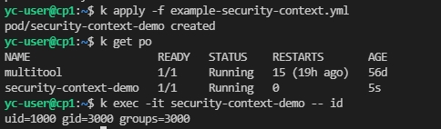
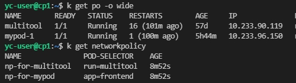
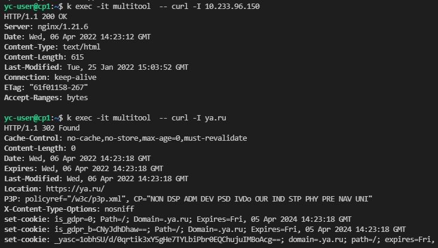
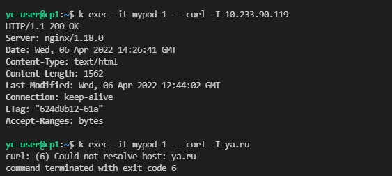

>### Домашнее задание к занятию "14.5 SecurityContext, NetworkPolicies"
>
>#### Задача 1: Рассмотрите пример 14.5/example-security-context.yml
>
>Создайте модуль
>
>```
>kubectl apply -f 14.5/example-security-context.yml
>```
>
>Проверьте установленные настройки внутри контейнера
>
>```
>kubectl logs security-context-demo
>uid=1000 gid=3000 groups=3000
>```



>#### Задача 2 (*): Рассмотрите пример 14.5/example-network-policy.yml
>
>Создайте два модуля. Для первого модуля разрешите доступ к внешнему миру
>и ко второму контейнеру. Для второго модуля разрешите связь только с
>первым контейнером. Проверьте корректность настроек.

Создал два пода и по [NetworkPolicy](example-network-policy.yml) для каждого:



Для пода multitool доступен mypod-1 и внешний мир:



Для пода mypod-1 доступен только multitool:


