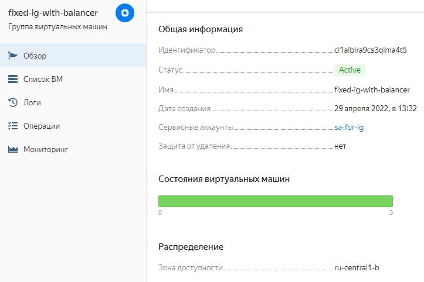
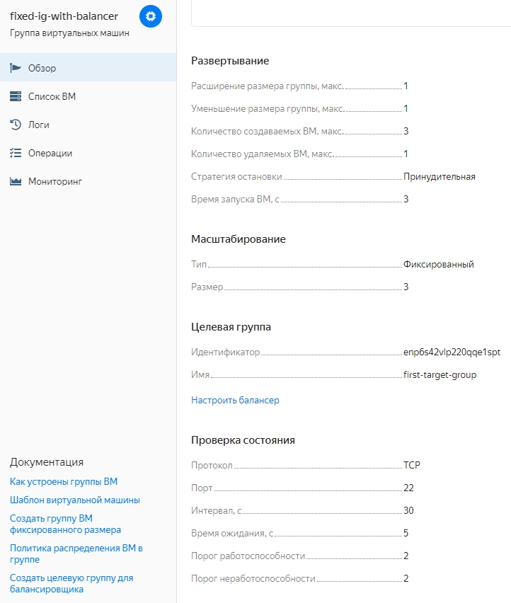
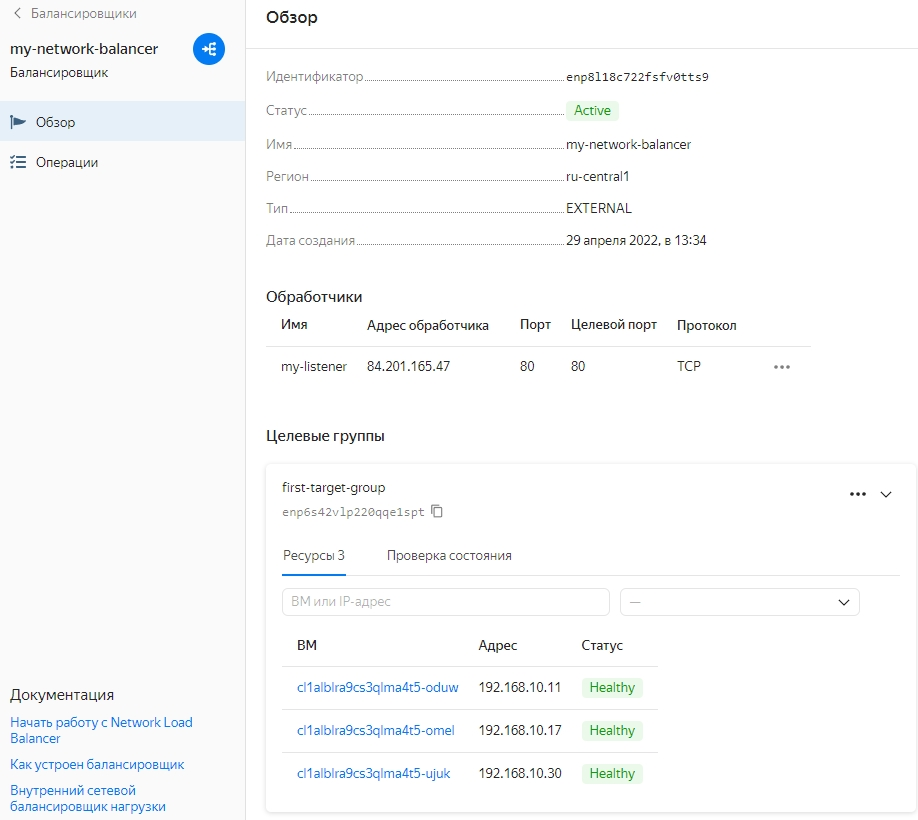
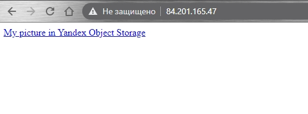
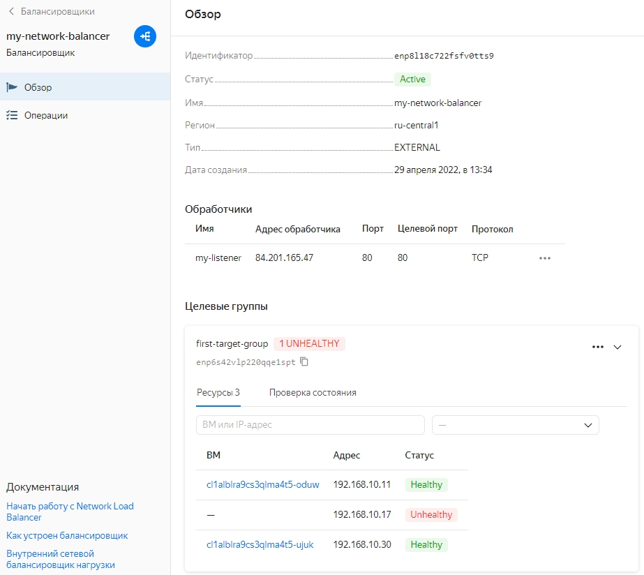

>### Домашнее задание к занятию 15.2 "Вычислительные мощности. Балансировщики >нагрузки".
>Домашнее задание будет состоять из обязательной части, которую необходимо >выполнить на провайдере Яндекс.Облако, и дополнительной части в AWS (можно >выполнить по желанию). Все домашние задания в 15 блоке связаны друг с другом и в >конце представляют пример законченной инфраструктуры.
>Все задания требуется выполнить с помощью Terraform, результатом выполненного >домашнего задания будет код в репозитории. Перед началом работ следует настроить >доступ до облачных ресурсов из Terraform, используя материалы прошлых лекций и ДЗ.
>
>---
>#### Задание 1. Яндекс.Облако (обязательное к выполнению)
>
>1. Создать bucket Object Storage и разместить там файл с картинкой:
>- Создать bucket в Object Storage с произвольным именем (например, >_имя_студента_дата_);
>- Положить в bucket файл с картинкой;
>- Сделать файл доступным из Интернет.

Конфиг - [bucket.tf](https://github.com/alex-k-7/devops-netology/blob/main/terraform/hw-15/bucket.tf)

Сcылка на [картинку](https://storage.yandexcloud.net/aks-netology-bucket/pic-1)

>2. Создать группу ВМ в public подсети фиксированного размера с шаблоном LAMP и >web-страничкой, содержащей ссылку на картинку из bucket:
>- Создать Instance Group с 3 ВМ и шаблоном LAMP. Для LAMP рекомендуется >использовать `image_id = fd827b91d99psvq5fjit`;
>- Для создания стартовой веб-страницы рекомендуется использовать раздел >`user_data` в [meta_data](https://cloud.yandex.ru/docs/compute/concepts/>vm-metadata);
>- Разместить в стартовой веб-странице шаблонной ВМ ссылку на картинку из bucket;
>- Настроить проверку состояния ВМ.
>3. Подключить группу к сетевому балансировщику:
>- Создать сетевой балансировщик;
>- Проверить работоспособность, удалив одну или несколько ВМ.

Конфиг для создания группы виртуальных машин и балансировщика - [instance-group.tf](https://github.com/alex-k-7/devops-netology/blob/main/terraform/hw-15/instance-group.tf)





Для создания страницы со ссылкой на бакет использовал файл cloud-config в разделе user-data:
```
#cloud-config
users:
  - name: aks
    groups: [ sudo ]
    sudo: [ "ALL=(ALL) NOPASSWD:ALL" ]
    shell: /bin/bash
    lock_passwd: false
    passwd: ***
write_files:
  - content: <html><a href="https://storage.yandexcloud.net/aks-netology-bucket/pic-1">My picture in Yandex Object Storage</a></html>
    path: /var/www/html/index.html
```


Удаляем одну машину



Страница доступна


>4. *Создать Application Load Balancer с использованием Instance group и проверкой >состояния.
>
>Документация
>- [Compute instance group](https://registry.terraform.io/providers/yandex-cloud/>yandex/latest/docs/resources/compute_instance_group)
>- [Network Load Balancer](https://registry.terraform.io/providers/yandex-cloud/>yandex/latest/docs/resources/lb_network_load_balancer)
>- [Группа ВМ с сетевым балансировщиком](https://cloud.yandex.ru/docs/compute/>operations/instance-groups/create-with-balancer)


