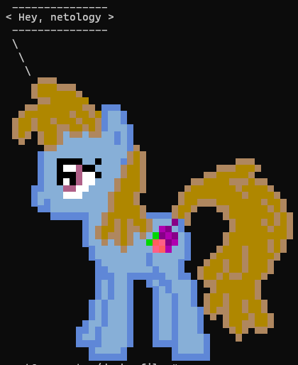
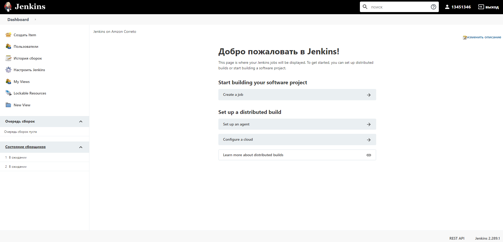

### Домашнее задание к занятию "5.4. Практические навыки работы с Docker"

>#### Задача 1 
>
>В данном задании вы научитесь изменять существующие Dockerfile, адаптируя их под нужный инфраструктурный стек.
>
>Измените базовый образ предложенного Dockerfile на Arch Linux c сохранением его функциональности.
>
>```text
>FROM ubuntu:latest
>
>RUN apt-get update && \
>    apt-get install -y software-properties-common && \
>    add-apt-repository ppa:vincent-c/ponysay && \
>    apt-get update
> 
>RUN apt-get install -y ponysay
>
>ENTRYPOINT ["/usr/bin/ponysay"]
>CMD ["Hey, netology”]
>```

```text
FROM archlinux:latest

RUN pacman -Sy && pacman -S --noconfirm ponysay

ENTRYPOINT ["/usr/bin/ponysay"]

CMD ["Hey, netology”]
```
В таком варианте докерфайла у меня получается следующий вывод:


Почему пони говорит "/bin/sh ["Hey, netology”]"? Не разобрался.
Нормальный вывод получается при таком варианте докерфайла:
```text
FROM archlinux:latest

RUN pacman -Sy && pacman -S --noconfirm ponysay

CMD ["ponysay", "Hey, netology”]
```



https://hub.docker.com/repository/docker/aksdoc/arch_ponysay


>#### Задача 2 
>
>В данной задаче вы составите несколько разных Dockerfile для проекта Jenkins, опубликуем образ в `dockerhub.io` и посмотрим логи этих контейнеров.
>
>- Составьте 2 Dockerfile:
>
>    - Общие моменты:
>        - Образ должен запускать [Jenkins server](https://www.jenkins.io/download/)
>        
>    - Спецификация первого образа:
>        - Базовый образ - [amazoncorreto](https://hub.docker.com/_/amazoncorretto)
>        - Присвоить образу тэг `ver1` 
>    
>    - Спецификация второго образа:
>        - Базовый образ - [ubuntu:latest](https://hub.docker.com/_/ubuntu)
>        - Присвоить образу тэг `ver2` 
>
>- Соберите 2 образа по полученным Dockerfile
>- Запустите и проверьте их работоспособность
>- Опубликуйте образы в своём dockerhub.io хранилище

Для получения зачета, вам необходимо предоставить:
- Наполнения 2х Dockerfile из задания
```text
FROM amazoncorretto

RUN yum install -y wget && \
    wget -O /etc/yum.repos.d/jenkins.repo https://pkg.jenkins.io/redhat-stable/jenkins.repo && \
    rpm --import https://pkg.jenkins.io/redhat-stable/jenkins.io.key && \
    yum install -y jenkins

ENTRYPOINT ["/usr/bin/java", "-jar", "/usr/lib/jenkins/jenkins.war"]
```  
- Скриншоты логов запущенных вами контейнеров (из командной строки)
  
- Скриншоты веб-интерфейса Jenkins запущенных вами контейнеров (достаточно 1 скриншота на контейнер)
  
- Ссылки на образы в вашем хранилище docker-hub

#### Задача 3 

В данном задании вы научитесь:
- объединять контейнеры в единую сеть
- исполнять команды "изнутри" контейнера

Для выполнения задания вам нужно:
- Написать Dockerfile: 
    - Использовать образ https://hub.docker.com/_/node как базовый
    - Установить необходимые зависимые библиотеки для запуска npm приложения https://github.com/simplicitesoftware/nodejs-demo
    - Выставить у приложения (и контейнера) порт 3000 для прослушки входящих запросов  
    - Соберите образ и запустите контейнер в фоновом режиме с публикацией порта

- Запустить второй контейнер из образа ubuntu:latest 
- Создайть `docker network` и добавьте в нее оба запущенных контейнера
- Используя `docker exec` запустить командную строку контейнера `ubuntu` в интерактивном режиме
- Используя утилиту `curl` вызвать путь `/` контейнера с npm приложением  

Для получения зачета, вам необходимо предоставить:
- Наполнение Dockerfile с npm приложением
- Скриншот вывода вызова команды списка docker сетей (docker network cli)
- Скриншот вызова утилиты curl с успешным ответом

